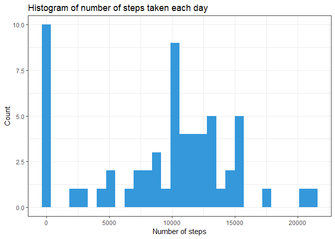
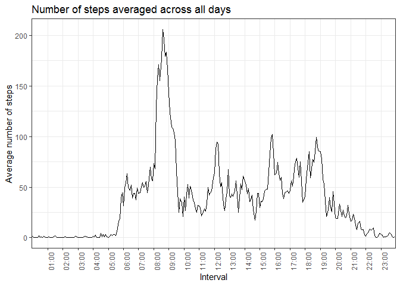
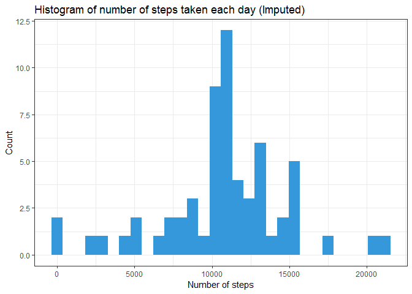
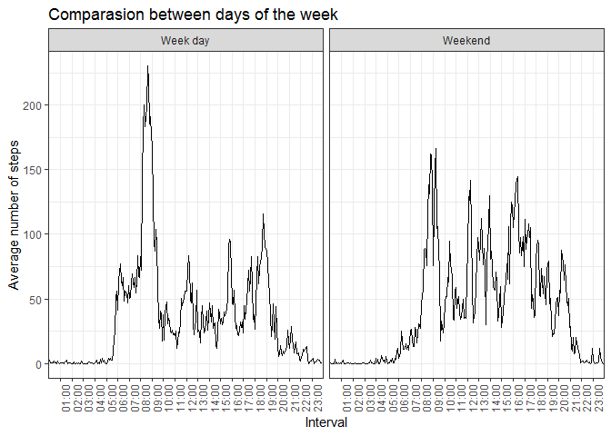

## Loading and preprocessing the data

For this part I will use two packages: **dplyr** and **lubridate**. The former is useful to process, transform and create variables, whereas the latter is useful to handle dates, since in the following sections the will be behavior comparisons between days, hence the package will be an useful tool.


```r
library(dplyr)
library(lubridate)

if(!file.exists("activity.csv")){
unzip("RepData_PeerAssessment1/activity.zip")
}

time_format <- function(x){
  n <- nchar(x)
    if(n != 4){
   s <-  paste(c(rep("0",(4-n)),x),collapse="")
     }else{
    s <- x
  }
    s <- paste0(substr(s,1,2),":",substr(s,3,4))
    s
  }

activity <- 
  read.csv("activity.csv",
           colClasses = c("numeric","character","numeric")
           ) %>% 
  arrange(interval) %>% 
  rowwise %>% 
  mutate(interval_tag = time_format(interval),
         date_time = ymd_hm(paste(date,interval_tag))
         ) %>% 
  arrange(date_time) %>% 
  select(-date,-interval,-interval_tag)
```

## What is mean total number of steps taken per day?


```r
library(ggplot2)

data_hist <- 
  activity %>% 
  group_by(date(date_time)) %>% 
  summarise(steps = sum(steps,na.rm = T)) %>% 
  ungroup

mean0 <- round(mean(data_hist$steps,na.rm = T),2)
median0 <- round(median(data_hist$steps,na.rm = T),2)

data_hist %>% 
  ggplot(aes(x = steps))+
  geom_histogram(aes(fill=""),show.legend = F)+
  scale_fill_manual(values="#3498DB")+
  labs(title = "Histogram of number of steps taken each day",
       x = "Number of steps",
       y = "Count")+
  theme_bw()
```

<!-- -->

The mean of the total number of steps taken per day is **9354.23** and the median is **10395** .

## What is the average daily activity pattern?


```r
library(ggplot2)

data_day <- activity %>% 
  mutate(time = format(date_time,"%H:%M"),
         time = factor(time,levels = unique(time))) %>% 
  group_by(time) %>% 
  summarise(steps = mean(steps,na.rm = T)) 

maxim <- data_day$time[which(data_day$steps == max(data_day$steps))]

data_day %>% 
  ggplot2::ggplot(aes(x = time, y = steps,group = 1))+
  geom_line()+
  scale_color_manual(values = "#229954")+
  scale_x_discrete(breaks = as.character(1:23) %>%
                     if_else(nchar(.)==1,
                             paste0("0",.),.) %>% 
                     paste0(.,":00")) +
  labs(title = "Number of steps averaged across all days",
       x = "Interval",
       y = "Average number of steps")+
  theme_bw()+
  theme(axis.text.x = element_text(angle = 90, hjust = 1))
```

<!-- -->

The interval in wich the steps were maximum was **08:35** .

## Imputing missing values


```r
miss <- activity %>% 
  filter(is.na(steps)) %>% 
  nrow
```

The total number of missing values in the dataset is: **2304** . The strategy selected is impute the missing values whit the mean value for each interval.

The histogram after imputing:


```r
new <-
  activity %>%
  mutate(time = format(date_time,"%H:%M"),
         time = factor(time,levels = unique(time))) %>%
  group_by(time) %>%
  mutate(mean_steps_time = mean(steps,na.rm = T),
         imputed_steps = if_else(is.na(steps),mean_steps_time,steps)) %>%
  ungroup %>%
  select(date_time,imputed_steps)

data_hist_2 <-
  new %>%
  group_by(date(date_time)) %>%
  summarise(imputed_steps = sum(imputed_steps,na.rm = T)) %>%
  ungroup

mean1 <- round(mean(data_hist_2$imputed_steps),2)
median1 <- round(median(data_hist_2$imputed_steps),2)

diference <- round(sum(new$imputed_steps) - sum(activity$steps,na.rm = T),2)

data_hist_2 %>% 
ggplot(aes(x = imputed_steps))+
  geom_histogram(aes(fill=""),show.legend = F)+
  scale_fill_manual(values="#3498DB")+
  labs(title = "Histogram of number of steps taken each day (Imputed)",
       x = "Number of steps",
       y = "Count")+
  theme_bw()
```

<!-- -->


The mean after imputing is **10766.19** and the median is **10766.19** . After imputing the total number of steps taken have increase in: **86129.51** . In the other hand, after imputing, the mean and median get closer, almost are the same.

## Are there differences in activity patterns between weekdays and weekends?


```r
new %>% mutate(time = format(date_time,"%H:%M"),
               time = factor(time,levels = unique(time)),
               week_day = wday(date_time,label = T),
               week = if_else(week_day %in% c("sáb","dom"),
                              "Weekend",
                              "Week day")) %>% 
  group_by(week,time) %>% 
  summarise(steps = mean(imputed_steps)) %>% 
  ungroup %>% 
  ggplot(aes(x=time,y=steps,group = week)) +
  scale_x_discrete(breaks = as.character(1:23) %>%
                     if_else(nchar(.)==1,
                             paste0("0",.),.) %>% 
                     paste0(.,":00")) +
  labs(title = "Comparasion between days of the week",
       x = "Interval",
       y = "Average number of steps")+
  geom_line()+
  facet_grid(.~week)+
  theme_bw()+
  theme(axis.text.x = element_text(angle = 90, hjust = 1))
```

<!-- -->


  

